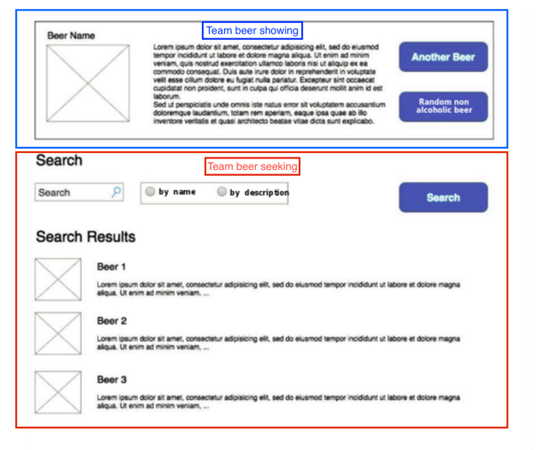

### Introduction

This development had been focused on making the project scalable. For that, techniques such as custom hooks, presentational and container components, usage of typescript, lint for conventional commits, and a code formatter have been used.

In the root folder, there are the configuration files and documentation. The application code is under `src` folder. 

```bash
src
├── components
├── constants
├── hooks
├── mocks
├── types
├── views
│   ├── components
│   ├── **/*.ts
```
The `components` folder under `src` will keep reusable components, that could be used by themselves, by the component views, or by the pages.

The `constants` folder will hold all the constants related to the application.

The `hooks` folder contains only re-usable hooks. Hooks that are dependent of only a component should be kept in the component folder. 

The `mocks` will have helpers for testing.  

The `types` folder will contain external types, such as API contracts or third party types. 

The `views` are the application pages. The building blocks to compose the views will be in the sibling `components` folder.

### Scripts

This application was created with [created react app](https://create-react-app.dev/docs/available-scripts/). Apart from the scripts available for `cra`, another one could be found in `package.json`:
* `npm run format`: format the code using `prettier` for the file `.ts`, `.tsx`, `.css`, `.md`

### Testing

For testing, the use of two libraries are encouraged, `react-testing-library` and `jest`. Jest will cover unit test and react testing library will be responsible for the integration test.

Coverage is up to 60% and for the test performed, some happy paths are tested, however due to time constraints most of them are missing.  

### Further development
In terms of scalability, would be efficient to split the application in micro frontends. Ideally, two micro frontends will be created at the beginning for the teams to work independently. 


Due to my lack of experience on this architecture, some challenges could be managing the shared resources/dependencies between micro frontends and finding the right compiling strategies for each of them.
